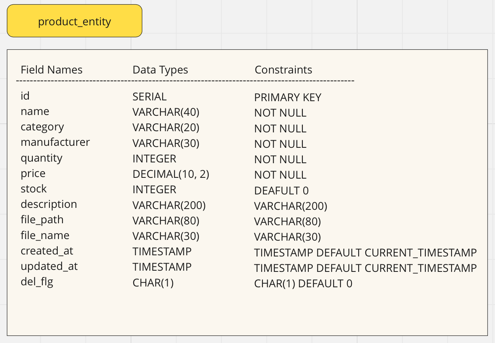

# Inventory Management System

Link to the deployed site:

### Contents
- [Overview](#overview)
- [Main Technologies Used](#main-technologies-used)
- [Functions](#functions)
- [User Stories](#user-stories)
- [Data Modeling](#data-modeling)
- [Each Page in Detail](#each-page-in-detail)
- [Deployment Process](#deployment-process)
- [Manual Testing](#manual-testing)
- [Bugs](#bugs)
- [Features to be Included in the Future](#features-to-be-included-in-the-future)
- [Credit](#credit)

### Overview
With this Inventory Management System, shop owners can register product information,
look at the product list, update and delete data.
The app comes with functions such as input validation, delete confirmation,
success/error messages upon registering, updating and deleting products.

### Main Technologies Used
HTML5, CSS3, Java (Spring Boot), Bootstrap5, jquery, PostgreSQL

### Functions
**Main functions**
- Register product data including images
- Display Product List
- Update products data
- Delete products

**Supplementary functions**
- Display success messages when products have been registered, updated or deleted.
- Validate input data while registering and updating products and show error messages
  if validation fails.
- Display a confirmation modal before deleting products.

### User Stories

*As user I...*

|Nr.| User Stories                               | How they are achieved |
| - | :----------------------------------------- | --------------------- |
| 1 | can register product information.          | register product page |
| 2 | can upload product image.                  | image can be uploaded on register & update pages |
| 3 | get notified if input data is inappropriate| validation messages  |
| 4 | can look at the product list               | product list page     |
| 5 | can find out how many products are registered. | total number of items is displayed above the table on the right side on product list page     |
| 6 | can update product information             | update product page   |
| 7 | can delete product                         | product list page     |
| 8 | get confirmation before deleting product   | product list   page   |
| 9 | can easily navigate through all pages      | navigation links, update buttons on list page |

### Data Modeling

The app uses the following 'Product' entity: 
 

### Each Page in Detail

1.Product Registration page 
2.Product List page 
3.Update page 

### Deployment Process

### Manual Testing
Manual Testing is documented [here](./documents/MANUAL-TESTING.md).

### Bugs
1. 'getProductList' and 'getProduct' methods were not getting camel-cased variables from the DB.(filePath, updatedAt)
I resolved the issue by adding the following line in application.properties. 
`mybatis.configuration.map-underscore-to-camel-case=true`

2. Clicking 'clear' didn't clear the information on registration page.
I changed the code as follows, and the issue was resolved. 

3. After clicking 'cancel' on update page, success message 'The product has been updated' appeared after redirecting to the list page.  I changed the code as follows in order to resolve the issue. 

4. application.properties 
${}

5. delete confirmation

Things to fix:
registration page
int can't be null
quantity min = 1, so don't allow the counter to go below 1.
also in case of "", fill in 1 onBlur with JS

### Features to be Included in the Future
- When products are deleted, I want to add a function to delete correponding images from S3 Bucket.
- It'd be nice to have search and filter functions for products.

### Credit

- On JUnit tests 
https://www.digitalocean.com/community/tutorials/junit-setup-maven
https://stackoverflow.com/questions/57465271/how-to-create-objects-for-all-junit-tests
https://stackoverflow.com/questions/29069956/how-to-test-validation-annotations-of-a-class-using-junit
https://ziqoo.com/cms/Java/MyBatis/生成されたMapperの動作確認
